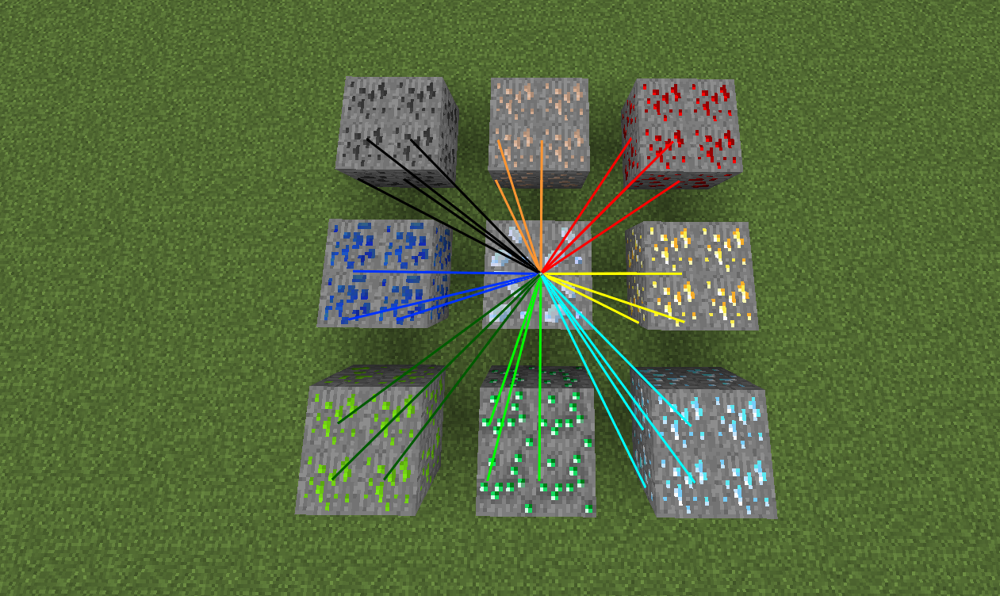
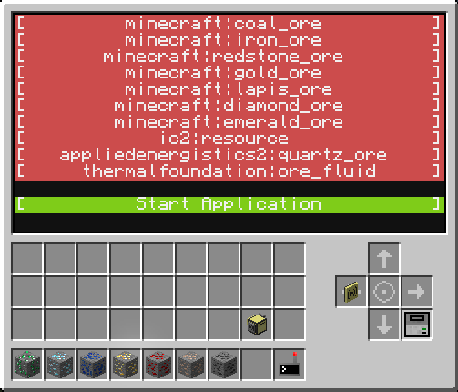
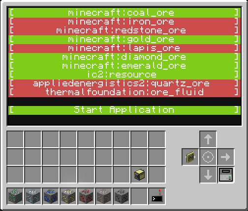

# Plethora-Ore-Tracers
Draws tracers to ores with Plethora and CC:Tweaked. The tracers have customizable colors and the selected ores can be chosen.

## Requirements
Requires Plethora and CC:Tweaked.

The required modules are Neural Interface, Overlay Glasses and Block Scanner. Without these, it simply cannot function.

## Examples
Here is a YouTube video demonstrating how it works. (Click the image to be redirected)

The tracers have different colours depending on what ore it's targetting.

It has an interface that lets you choose what ores you want to target.

By clicking on an item you can select it. Clicking said item again unselects it

### Bugs
No bugs have been found as of yet, but if you do find one, please leave it as an issue here on GitHub so I can get to fixing it. Thank you
